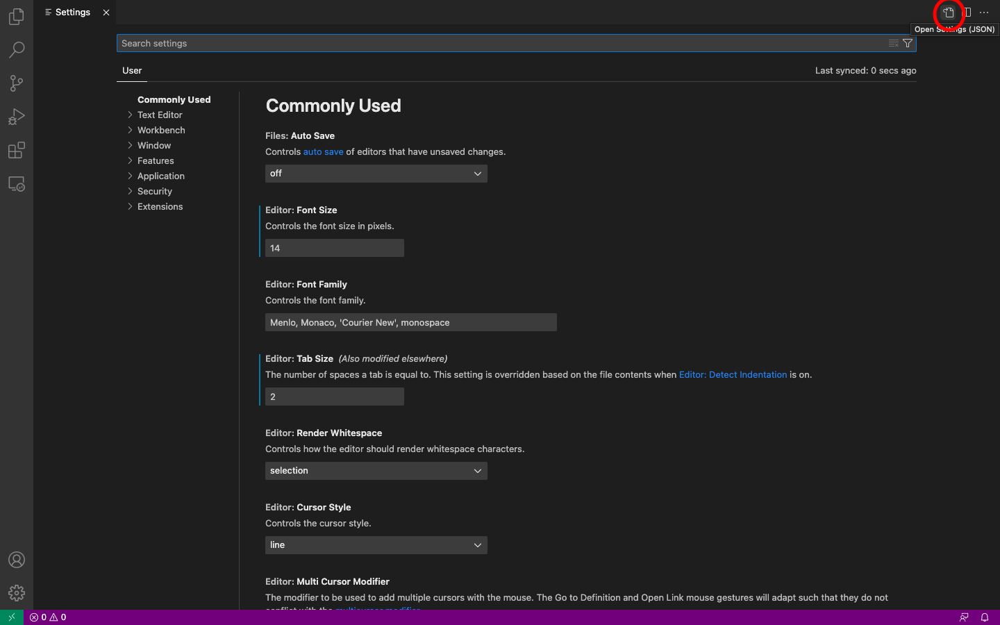
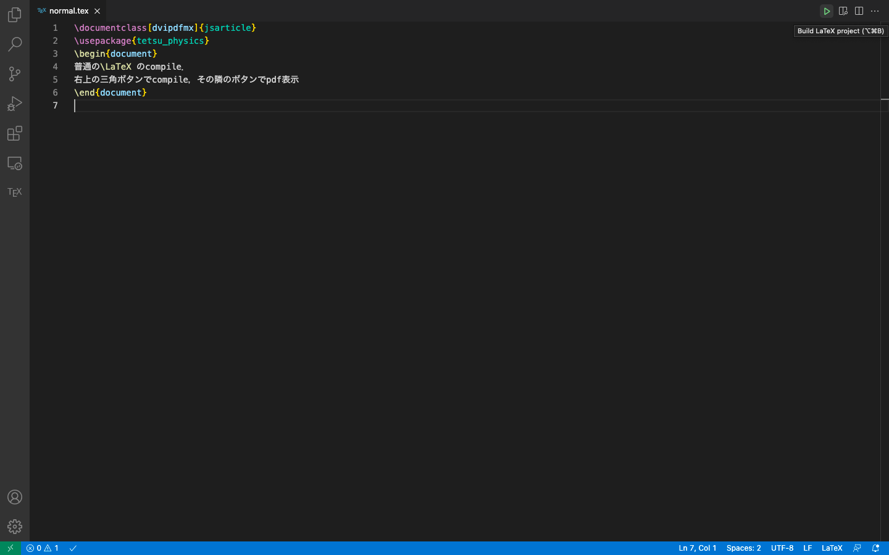
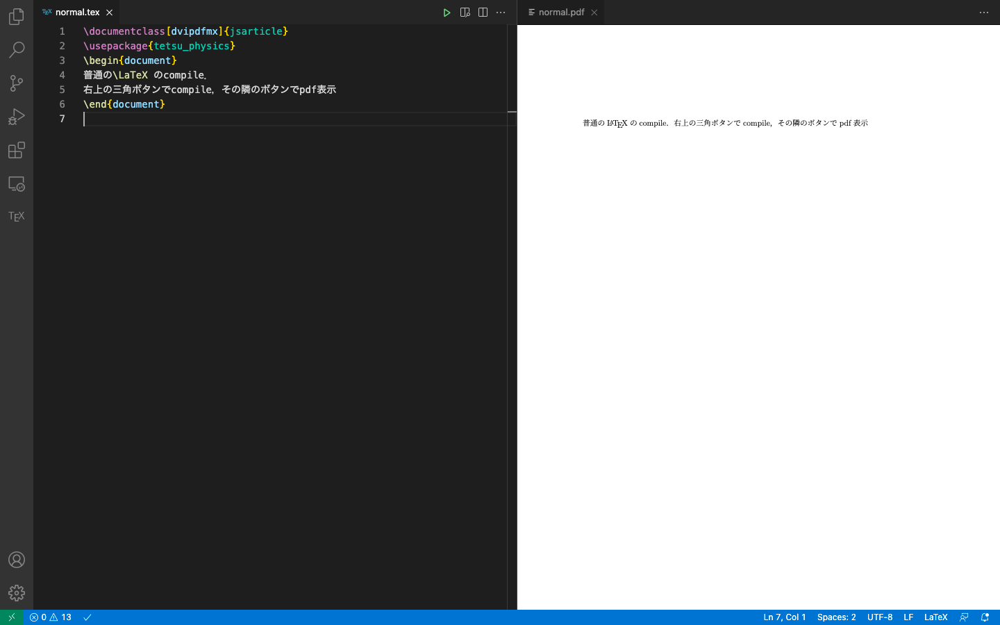
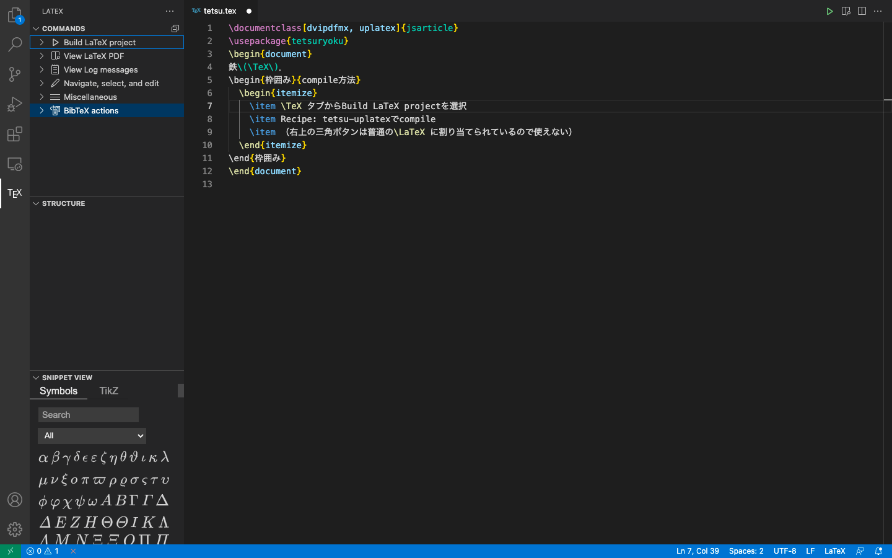
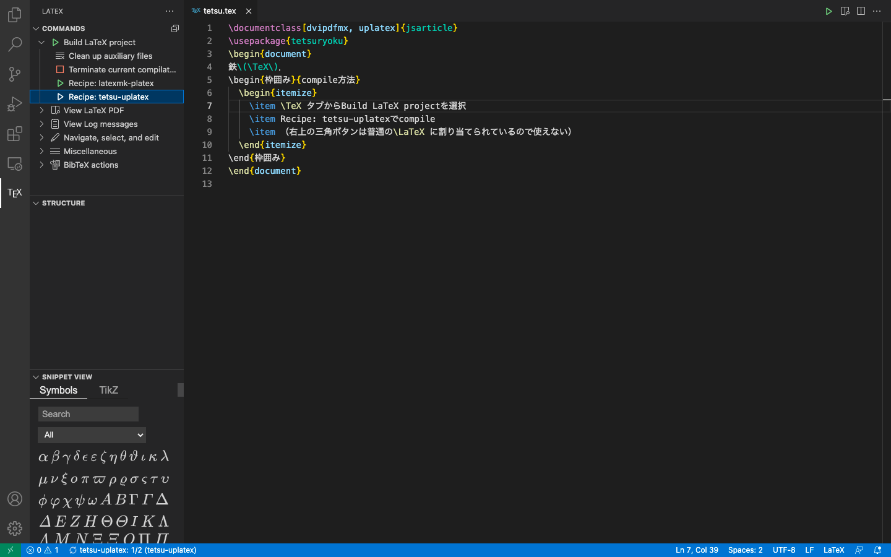
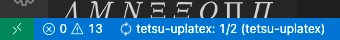
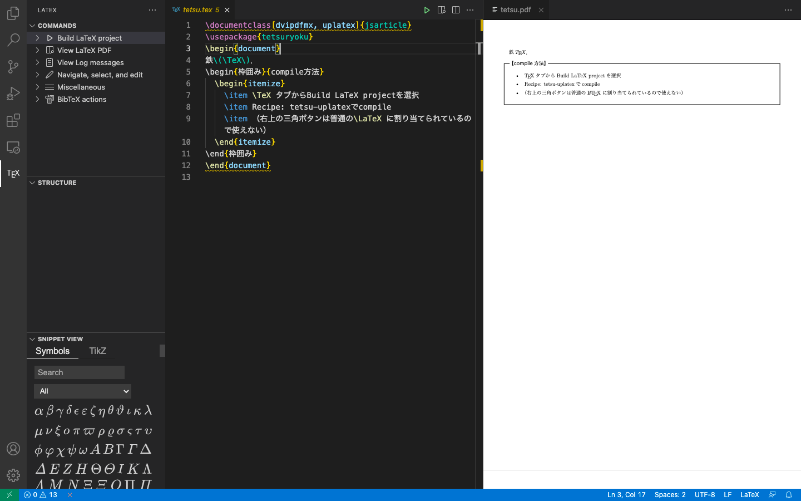
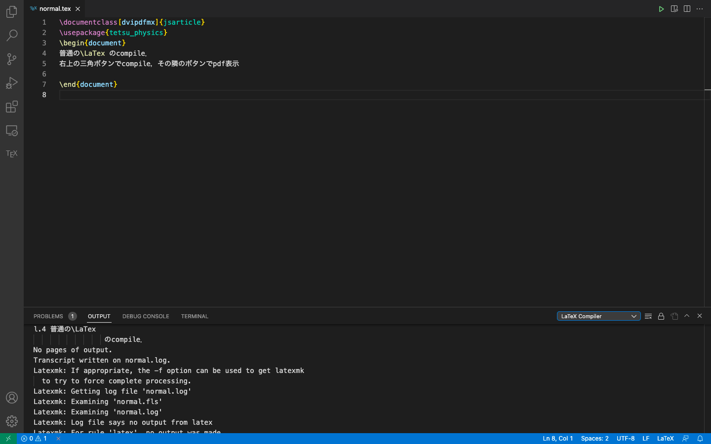

# setting-up
物理科で教材を作成する為に必要なmacの環境構築です．

- [インストール](#install)
- [コンパイル](#compile)
- [鉄TeX](#鉄tex任意)
- [トラブルシューティング](#トラブルシューティング)

## Install
### Homebrew
ターミナル：
```sh
/bin/bash -c "$(curl -fsSL https://raw.githubusercontent.com/Homebrew/install/master/install.sh)"
```
**注意１** ターミナルで`Password: `と言う風にパスワードを求められることがあります．
Macに設定しているパスワードを入力してください（自分が打った文字は出てこない）．

**注意２** （2020年以降のmacで）ターミナルで`brew`と打ち込んで，`zsh: command not found: brew`となった場合は，ターミナル：
```sh
echo export PATH="/opt/homebrew/bin:\$PATH" >> ~/.zshrc
```

### データの取得
ネットに上げてるデータを取得します．ターミナルで以下の文章を打ってください（全部コピペでok）：
```sh
brew install git
git clone https://github.com/tetsu-osaka-physics/setting-up.git ~/FOR
```
必要なデータが`~/FOR`に入ります．

### mactex
```sh
brew install mactex-no-gui --cask
```

### VS Code
VS Code（エディター）の設定をします．
ターミナル：
```sh
brew install visual-studio-code
code --install-extension James-Yu.latex-workshop
```
VS Codeを開いて，`command+,`を押してSettingを開く．右上のOpen Settings (JSON)をクリック

`settings.json`に以下のコードをコピペ
```JSON
{
    "latex-workshop.latex.recipes": [
        {
            "name": "latexmk-platex",
            "tools": ["latexmk-platex"]
        },
        {
            "name": "tetsu-uplatex",
            "tools": ["tetsu-uplatex", "tetsu-dvipdfmx"]
        }
    ],
    "latex-workshop.latex.tools": [
        {
            "name": "latexmk-platex",
            "command": "latexmk",
            "args": [
                "-latex=platex",
                "-synctex=1",
                "--halt-on-error",
                "-pdfdvi",
                "-outdir=%OUTDIR%",
                "%DOC%"
            ],
            "env": {}
        },
        {
            "name": "tetsu-uplatex",
            "command": "/usr/local/tetex/bin/uplatex",
            "args": [
                "--halt-on-error",
                "--shell-escape",
                "%DOC%"
            ],
            "env": {}
        },
        {
            "name": "tetsu-dvipdfmx",
            "command": "/usr/local/tetex/bin/dvipdfmx",
            "args": [
                "%DOCFILE%"
            ]
        }
    ],
    "latex-workshop.latex.autoBuild.run": "never",
    "latex-workshop.viewer.pdf.internal.port": 0,
}
```

### dvipdfmxのフォント埋め込み設定
ターミナル：
```sh
sudo tlmgr update --self --all
sudo tlmgr repository add http://contrib.texlive.info/current tlcontrib
sudo tlmgr pinning add tlcontrib '*'
sudo tlmgr install japanese-otf-nonfree japanese-otf-uptex-nonfree ptex-fontmaps-macos cjk-gs-integrate-macos
sudo cjk-gs-integrate --link-texmf --cleanup
sudo cjk-gs-integrate-macos --link-texmf
sudo mktexlsr
sudo kanji-config-updmap-sys --jis2004 hiragino-highsierra-pron
```
代替コマンド（*上のやつやっても上手く行かない場合は試す*）：
```sh
sudo cp -r ~/FOR/texmf-local/fonts/map /usr/local/texlive/texmf-local/fonts
sudo cp -r ~/FOR/texmf-local/fonts/opentype/hiragino /usr/local/texlive/texmf-local/fonts/opentype/
sudo mktexlsr
sudo kanji-config-updmap-sys hiragino-highsierra-pron
sudo mktexlsr
```

### latexmkの設定
ターミナル：
```sh
cp ~/FOR/latexmkrc ~/.latexmkrc
```

## 特殊styの設定
ターミナル：
```sh
cp ~/FOR/get-sty.sh ~/Desktop/get-sty.sh
chmod a+x ~/Desktop/get-sty.sh
~/Desktop/get-sty.sh
```
アップデートの際はデスクトップ上の`get-sty.sh`を**ターミナルから**開く．パスワードを求められる．
<a target="_blank" href="https://github.com/tetsu-osaka-physics/tetsu_physic#%E5%88%9D%E5%9B%9E%E5%B0%8E%E5%85%A5%E6%99%82%E3%81%AE%E8%A8%AD%E5%AE%9A">代替方法１</a>
<a target="_blank" href="https://github.com/tetsu-osaka-physics/tetsu_physic/wiki/develop#%E3%83%AD%E3%83%BC%E3%82%AB%E3%83%AB%E3%81%B8%E3%81%AEclone">代替方法２</a>

## 不要ファイルの削除コマンド（推奨）
ターミナル：
```sh
cp ~/FOR/autodelete.sh ~/Desktop/autodelete.sh
cd ~/Desktop
chmod a+x autodelete.sh
```
TeXでコンパイルすると，不要な中間ファイル（`.aux`など）が生成されます．
デスクトップにできた`autodelete.sh`を開けば勝手に削除してくれます（ターミナルから開くように設定）．

**ターミナルで使いたい人向け**
ターミナル：
```sh
cp ~/for/autodelete.sh /usr/local/bin/autodelete.sh
chmod a+x /usr/local/bin/autodelete.sh
```
あとは，ターミナル上で`autodelete`と打てば実行される．例：
```sh
cd SynologyDrive/tetsu/h2p
autodelete
```
この場合，`SynologyDrive/tetsu/h2p`以下のディレクトリだけを検索・削除対象にするので早く終わる．

### inkscape
ターミナル：
```sh
brew install inkscape --cask
```
図の細かい話は[wiki](https://github.com/tetsu-osaka-physics/tetsu_physic/wiki/figure)参照．

## Compile
`command+option+b`でcompile．`command+option+v`でpdf表示．
もしくは右上の三角形のボタンでcompile，その隣のボタンでpdf表示．



Compile中の動作


成功：


失敗：


pdf表示



## 鉄TeX（任意）
### Install
校内模試講評・H2問題集に関しては，鉄TeXで作る必要があります（ただし，鉄TeXは年に２度しか使わないし，共用のMacでも使えるから，わざわざ入れる必要はない）．
サーバーにつないだ状態で，
```sh
cp /Volumes/1_ユーザ_Osaka/00_共通/98_鉄TeX/TeXインストール用ファイル/TetsuTeX.dmg ~/Desktop/
```
でデスクトップに入った`TetsuTeX.dmg`を開く．
この時，右クリック（２本指でタップ）して 「開く」を選択しないと開けないかも．
<!-- ターミナル：
```sh
echo export PATH=\$PATH:/usr/local/tetex/bin >> ~/.bash_profile
```
（zshの人は`.bash_profile`じゃなくて`.zshrc`） -->
<!-- ```sh
atom ~/.bash_profile
```
でatomを開いて，
```
export PATH="/usr/local/tetex/bin:$PATH"
```
を追加します（この時，`export PATH="/usr/local/texlive/2019/bin/x86_64-darwin:$PATH"`よりも上の行に書くこと！）． -->
<!-- **以下の手順は，エラーが出たら行ってください！**
次に，鉄TeXのエラーを解決します．変数のパスがアレなのと，鉄TeXで`余白とヘッダ.sty`と`機密ラベル.sty`が見つからないと言われる．ターミナル：
```sh
mv ~/FOR/styhelp.sh ~/Desktop/styhelp.sh
cd ~/Desktop
chmod a+x styhelp.sh
```
これで`styhelp.sh`がデスクトップに保存されるので，あとは実行するだけ（アップデートした後もこれを実行する）． -->
<!-- ヒラギノフォントの埋め込みは，
```sh
cp -r ~/FOR/texmf-local/fonts/opentype/hiragino /usr/local/tetex/share/texmf/fonts/opentype
/usr/local/tetex/bin/mktexlsr
/usr/local/tetex/bin/updmap-sys
/usr/local/tetex/bin/mktexlsr
``` -->
次に，鉄TeXをアップデートしましょう．
`command + k`で`afp://192.168.20.5`に繋いで，「ユーザー」に入った後に，鉄TeXアップローダーをクリックすればできます．
<!-- アップデートしたらstyが見つからないエラーが多分起こるので，デスクトップの`styhelp.sh`を実行すれば良い． -->
<!-- アップデートすればフォントやstyのエラーは発生しない(2020/9/3)． -->
<!-- mktexlsrしたのが原因だった(2021/3/13)． -->

### Compile
<!-- 鉄TeXを使う時はAtomのlatexパッケージで
- Path: `/usr/local/tetex/bin`
- Engine: `uplatex`
に設定． -->
1. 左のTeXタブからBuild LaTeX projectの`>`ボタンを押す
2. Recipe: tetsu-uplatexを押す
3. compileできたら右上のボタンでpdf表示

TeXタブからBuild LaTeX projectを展開


recipeの選択


Compile中の動作


&rarr;


成功：


失敗：


pdf表示


ターミナルからやるなら，
```sh
/usr/local/tetex/bin/uplatex --shell-escape hoge.tex
```
でコンパイルして
```sh
/usr/local/tetex/bin/dvipdfmx hoge.dvi
```
でpdfにできる．

## トラブルシューティング
### VS Code
#### Compile
&#128104;&#8205;&#128295; Compileが失敗した（左下のstatusが&#10060;）

&rarr;`command+shift+U`でoutputを表示．

スクロールしてエラー箇所を見つける．
画像の場合は
```log
! Undefined control sequence.
l.4 普通の\LaTex
                 のcompile．
```
4行目の`\LaTex`コマンドが未定義（正しくは`\LaTeX`）

&#128104;&#8205;&#128295; Compileが終わらない

&rarr;何かしらのエラー（styが見つからないとか）が起きている．
TeXタブ&rarr;Build LaTeX project&rarr;Terminate current compilationで強制終了し，上の手順と同じくoutputを確認．

### Atom
#### Compile
&#128104;&#8205;&#128295; Atomでコンパイル(`ctrl + alt + b`)しようとするとlatexでのコンパイルになりエラーが出る，もしくは勝手にソースファイルのレイアウトが変わる．

&rarr;texを編集している状態のAtomで`command + .`でkey bind resolverを開き，`ctrl + alt + b`と打つ．
この時に，最上位にlatexが来ていなければkey bindが原因．`command + ,`で設定&rarr;Keybindings&rarr;your keymap file（上の方の大文字）で`keymap.cson`を開き，最後に
```CSON
'atom-text-editor[data-grammar~="latex"]':'ctrl-alt-b': 'latex:build'
```
を付け加える．

&#128104;&#8205;&#128295; pdfが出てこない

&rarr;ターミナル：
```sh
echo "PDFJS.disableWorker = true;" >> ~/.atom/packages/pdf-view/lib/pdf-editor-view.js
```

&#128104;&#8205;&#128295; `\]`が勝手に出てくる

&rarr;設定(`command + ,`)を開き，Packages&rarr;latexerを選択して，Autocomplete environmentsを外す．

### 鉄TeX
#### Update
&#128104;&#8205;&#128295;TestuTeXアップデーターが使えない
&rarr;サーバーに繋いだ状態で，
```sh
sudo /Volumes/1_ユーザ_Osaka/00_共通/98_鉄TeX/TeXインストール用ファイル/鉄TeXアップデート.command
```
と入力する．

&#128104;&#8205;&#128295;鉄TeXがアップデートを強要してくる
&rarr;アップデートしましょう．若しくは
```sh
sed -i '' -e's/@warning@leveltwo{90}/@warning@leveltwo{10000}/g' /usr/local/tetex/share/texmf/ptex/platex/tetsutex/tetsuryoku.sty
```

### Homebrewの不具合
&#128104;&#8205;&#128295;なんか不具合起きてますよ
```sh
brew doctor
```
で解決策が提示されれば従う．それでも治らなければ
```sh
/bin/bash -c "$(curl -fsSL https://raw.githubusercontent.com/Homebrew/install/master/uninstall.sh)"
```
でアンインストール．

# Windows編
## dvipdfmxのフォント埋め込み設定
### bizud
```batchfile
kanji-config-updmap-sys bizud
```
`\KAlpha`，`\KRoman`，`\Kroman`，`\KHira*`，`\KKata*`，`\KKiroha*`，`\KHiroha*`が括弧つかない．

### haranoaji
```batchfile
kanji-config-updmap-sys haranoaji
```
`\KRoman`，`\Kroman`，`\KHira*`，`\KKata*`，`\KKiroha*`，`\KHiroha*`が文字化け．

<!-- ### hiragino
ヒラギノはWindowsには入ってないので購入の必要あり．コマンドプロンプト（管理者）：
```batchfile
updmap-sys --setoption kanjiEmbed hiragino-pron
mkdir C:\texlive\texmf-local\fonts\opentype\hiragino
mklink C:\texlive\texmf-local\fonts\opentype\hiragino\HiraMinPro-W3.otf C:\Windows\Fonts\ヒラギノ明朝 Pro W3.otf
mklink C:\texlive\texmf-local\fonts\opentype\hiragino\HiraMinPro-W6.otf C:\Windows\Fonts\ヒラギノ明朝 Pro W6.otf
mklink C:\texlive\texmf-local\fonts\opentype\hiragino\HiraKakuPro-W3.otf C:\Windows\Fonts\ヒラギノ角ゴ Pro W3.otf
mklink C:\texlive\texmf-local\fonts\opentype\hiragino\HiraKakuPro-W6.otf C:\Windows\Fonts\ヒラギノ角ゴ Pro W6.otf
``` -->

<!-- ### hiragino-pron
ヒラギノはWindowsには入ってないので購入の必要あり．コマンドプロンプト（管理者）：
```batchfile
updmap-sys --setoption kanjiEmbed hiragino-pron
mkdir C:\texlive\texmf-local\fonts\opentype\hiragino
mklink C:\texlive\texmf-local\fonts\opentype\hiragino\HiraMinProN-W3.otf C:\Windows\Fonts\ヒラギノ明朝 ProN W3.otf
mklink C:\texlive\texmf-local\fonts\opentype\hiragino\HiraMinProN-W6.otf C:\Windows\Fonts\ヒラギノ明朝 ProN W6.otf
mklink C:\texlive\texmf-local\fonts\opentype\hiragino\HiraKakuProN-W3.otf C:\Windows\Fonts\ヒラギノ角ゴ ProN W3.otf
mklink C:\texlive\texmf-local\fonts\opentype\hiragino\HiraKakuProN-W6.otf C:\Windows\Fonts\ヒラギノ角ゴ ProN W6.otf
``` -->

### ipa
```batchfile
kanji-config-updmap-sys ipa
```
使い物にならない．

### ipaex
```batchfile
kanji-config-updmap-sys ipaex
```
使い物にならない．

### kozuka-pr6n（推奨）
1. Adobe Acrobat Readerをダウンロード．

2. `C:\Program Files (x86)\Adobe\Acrobat Reader DC\Resource\CIDFont`にある`KozGoPr6N-Medium.otf`と`KozMinPr6N-regular.otf`を管理者権限で全ユーザーにインストール．

3. コマンドプロンプト（管理者）：
  ```batchfile
  updmap-sys --setoption kanjiEmbed kozuka-pr6n
  mkdir C:\texlive\texmf-local\fonts\opentype\kozuka
  mklink C:\texlive\texmf-local\fonts\opentype\kozuka\KozMinPr6N-regular.otf C:\Windows\Fonts\KozMinPr6N-regular.otf
  mklink C:\texlive\texmf-local\fonts\opentype\kozuka\KozGoPr6N-regular.otf C:\Windows\Fonts\KozGoPr6N-Medium.otf
  mklink C:\texlive\texmf-local\fonts\opentype\kozuka\KozMinPr6N-Bold.otf C:\Windows\Fonts\KozGoPr6N-Medium.otf
  mklink C:\texlive\texmf-local\fonts\opentype\kozuka\KozGoPr6N-Bold.otf C:\Windows\Fonts\KozGoPr6N-Medium.otf
  ```
`\textgt`と`\textbf`の区別がなくなるが，文字化けは無い．

### ms
コマンドプロンプト：
```batchfile
kanji-config-updmap-sys ms
```
`\KAlpha`，`\KRoman`，`\Kroman`，`\KHira*`，`\KKata*`，`\KKiroha*`，`\KHiroha*`が括弧つかない．

### noEmbed（非推奨）
```batchfile
kanji-config-updmap-sys noEmbed
```

### yu-win10
```batchfile
updmap-sys --setoption kanjiEmbed yu-win10
```
`\KAlpha`，`\KRoman`，`\Kroman`，`\KHira*`，`\KKata*`，`\KKiroha*`，`\KHiroha*`が括弧つかない．
